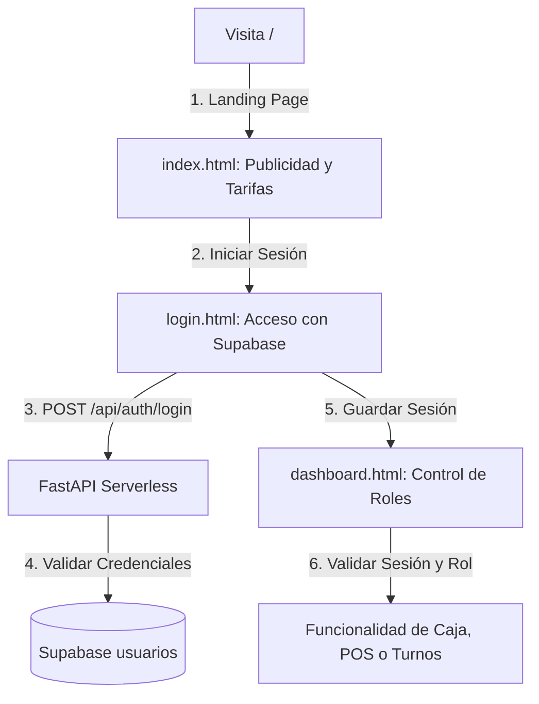

# Plan de Implementación: Mejora Completa del Lavadero (Diseño Premium + Landing Page + Auth + Control de Roles)

Realizaremos una reestructuración integral de la aplicación para dotarla de un diseño visual de primer nivel (Wow-Factor UI), una página de publicidad/captación de clientes en la raíz, un portal de acceso seguro vinculado a Supabase y protección de roles en el panel de control.

---

## 1. Mapa de Enrutamiento y Flujo de Navegación (Vercel SPA)

### A. Página de Publicidad (index.html)
* **Objetivo:** Captación y marketing.
* **Alineación Visual:** Gradientes vivos de violeta oscuro (`#0F172A`) a violeta eléctrico (`#8B5CF6`) y azul cian (`#0EA5E9`).
* **Secciones:** Hero Banner, Estadísticas de Clientes Felices (NPS), Selector de Tarifas y Servicios Interactivos (Lavado Simple, Completo, Motor, Pulido), Testimonios, y Botón de Acción destacado (CTA) para ingresar al sistema de gestión de personal.

### B. Portal de Acceso (login.html)
* **Objetivo:** Autenticación de personal mediante la tabla `usuarios` existente en Supabase.
* **Características:**
  * Tarjeta de login con efecto espejo y desenfoque (backdrop-filter).
  * Validación local de campos y feedback de carga.
  * Conexión asíncrona a `/api/auth/login`. Al autenticarse, guarda la sesión (`id_usuario`, `nombre`, `rol`) en el `localStorage` del navegador y redirige a `/dashboard`.

### C. Dashboard Premium (dashboard.html)
* **Objetivo:** Consolidado de control.
* **Control de Acceso (RBAC):**
  * Si no hay sesión iniciada, redirige de inmediato a `/login`.
  * Muestra el nombre y rol del usuario conectado en la barra superior.
  * **Roles Habilitados (RBAC):**
    * **`superadmin` / `administrador`:** Acceso total a todas las herramientas (POS, Apertura/Cierre de Caja, Equipo de Trabajo, Turnos y Analíticas).
    * **`mozo` / `cocina` (Operadores):** Únicamente visualizan la Agenda de Turnos y pueden cambiar el estado del lavado (Iniciar/Completar). El POS de ventas y la caja diaria se bloquean visualmente mostrando un cartel de restricción de permisos.

### D. Enrutamiento Limpio (vercel.json)
Habilitaremos `"cleanUrls": true` para que las rutas del navegador sean:
* `https://lavadero.vercel.app/` (Landing Page)
* `https://lavadero.vercel.app/login` (Auth Portal)
* `https://lavadero.vercel.app/dashboard` (Workspace Panel)

---

## Proposed Changes

### [Componente: Backend FastAPI (Python)]
*APIs de autenticación e integración.*

#### [MODIFY] [main.py](file:///c:/Lavadero/automation-python/api/main.py)
- Crear el endpoint `POST /api/auth/login` que valide la contraseña y username contra la tabla `usuarios` de Supabase.
- Proveer fallback mock de usuarios si la DB está desconectada para mantener la app 100% interactiva en modo demo.

---

### [Componente: Frontend Premium Vercel (HTML/JS)]
*Pantallas e interfaz estática.*

#### [NEW] [login.html](file:///c:/Lavadero/login.html)
- Vista del portal de acceso con diseño visual premium, validación y redirección segura.

#### [NEW] [dashboard.html](file:///c:/Lavadero/dashboard.html)
- Mover la UI del panel de control de `index.html` a `dashboard.html` y aplicar restricciones de rol (RBAC) y validación de inicio de sesión.

#### [MODIFY] [index.html](file:///c:/Lavadero/index.html)
- Reestructurar el archivo raíz para convertirlo en una Landing Page publicitaria del lavadero.

#### [MODIFY] [vercel.json](file:///c:/Lavadero/vercel.json)
- Habilitar `"cleanUrls": true` en la raíz.

---

## 2. Plan de Verificación

1. **Autenticación:** Validar que al ingresar credenciales incorrectas se muestre un aviso de error. Probar con `super@admi.com` y `superadmi2026/` para verificar el login exitoso.
2. **Restricción de Roles:**
   * Entrar como `enzo` (Mozo) y verificar que no se pueda usar el POS ni abrir/cerrar caja diaria.
   * Entrar como `admin` (Superadmin) y verificar el acceso ilimitado.
3. **Redirección de Seguridad:** Intentar abrir `/dashboard` sin haber iniciado sesión para comprobar que redirija automáticamente a `/login`.
