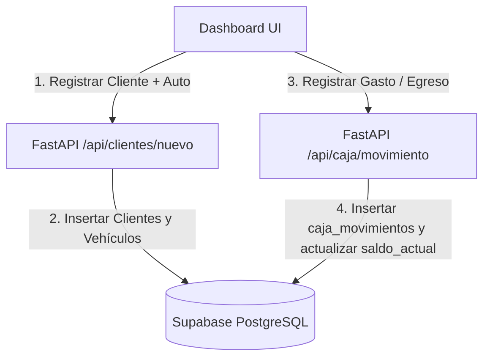

# Plan de Implementación: Módulo CRM (Registro Rápido de Vehículos) y Libro de Movimientos de Caja

Ampliaremos el software agregando dos herramientas críticas para la operación real: un **registro rápido de clientes y vehículos** en el Dashboard para agilizar el ingreso de autos nuevos, y un **libro contable de caja** (Ingresos y Egresos de efectivo) para tener un control granular del dinero.

---

## 1. Diseño del Flujo Comercial

### A. Módulo CRM: Alta Rápida de Clientes y Vehículos
* **Interconectividad:** En el panel de control, agregaremos una pestaña o formulario colapsable donde el cajero puede registrar a un nuevo cliente (Nombre, Teléfono, Email) y asociar de inmediato su auto (Patente, Marca, Modelo, Color, Año).
* **Dinámica AJAX:** Al enviar el formulario, las listas desplegables (dropdowns) de la agenda de turnos y punto de venta se actualizarán al instante sin recargar la página, seleccionando por defecto el nuevo registro.

### B. Libro de Movimientos de Caja (`caja_movimientos`)
Para evitar descuadres en el arqueo de caja, permitiremos registrar movimientos manuales de dinero:
* **Egresos:** Pagos de insumos, comidas del personal, viáticos.
* **Ingresos Extra:** Cambio de monedas, aportes manuales.
* **Fórmula de Saldo Activo:** El `saldo_actual` de la caja abierta se calculará sumando la apertura, las ventas realizadas y los movimientos manuales (`Ingresos` - `Egresos`).
* **Visualización:** El widget de Caja Diaria mostrará un historial en miniatura de las últimas transacciones de caja de ese día.

---

## Proposed Changes

### [Componente: Estructura de Base de Datos]
*Definición de esquemas para el histórico de caja.*

#### [MODIFY] [schema.sql](file:///c:/Lavadero/database/schema.sql)
- Crear la tabla `caja_movimientos` y registrar movimientos semilla de prueba.

---

### [Componente: Analítica y APIs en Python]
*Implementación de endpoints CRM y Caja.*

#### [MODIFY] [main.py](file:///c:/Lavadero/automation-python/api/main.py)
- Agregar endpoint `POST /api/clientes/nuevo` para dar de alta clientes.
- Agregar endpoint `POST /api/vehiculos/nuevo` para vincular vehículos.
- Agregar endpoint `POST /api/caja/movimiento` que inserta egresos/ingresos y actualiza el `saldo_actual` de la caja activa.
- Actualizar `GET /api/dashboard-data` para retornar la lista de movimientos de caja activos.

---

### [Componente: Panel de Control (HTML/JS)]
*Nuevos widgets e interactividad.*

#### [MODIFY] [dashboard.html](file:///c:/Lavadero/dashboard.html)
- Añadir el formulario de registro rápido **"➕ Registrar Cliente & Vehículo"** en la primera columna.
- Añadir el listado e inserción de movimientos de caja (Egresos/Ingresos) en la tarjeta de Caja Diaria.
- JavaScript AJAX para actualizar dropdowns e impactar el saldo en vivo.

---

## 2. Plan de Verificación

### Pruebas de Flujo
1. **Alta CRM:** Registrar al cliente "Emilio Sanz" con patente "AG999ZZ". Validar que aparezca inmediatamente en el listado de agendado de turnos.
2. **Libro de Caja:** Agregar un egreso de $1,200 por "Compra de esponjas". Verificar que el `saldo_actual` de la caja abierta disminuya de forma exacta en el dashboard.
