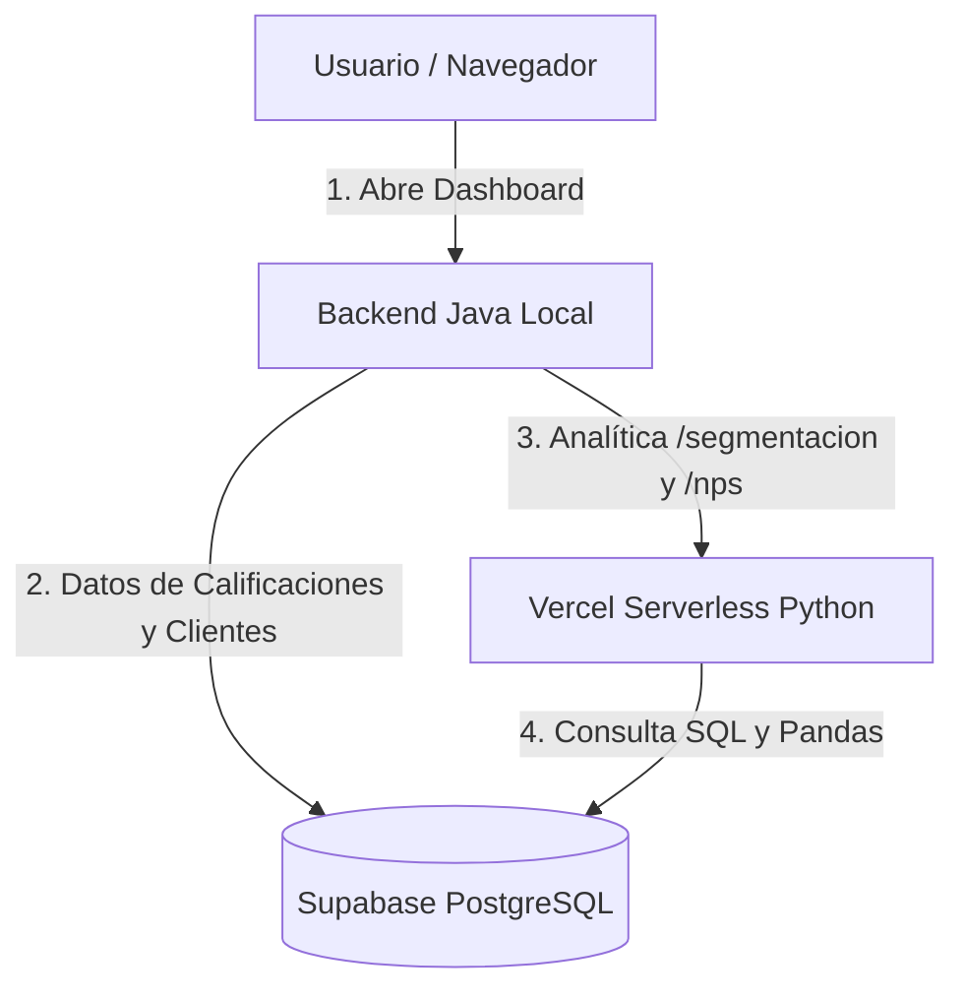

# Plan de Implementación: Despliegue Serverless de Python en Vercel

Dado que has conectado el repositorio a **Vercel**, configuraremos el proyecto para que el microservicio de analítica de Python (FastAPI, Pandas) se despliegue automáticamente en la nube como funciones serverless cada vez que realices un `git push`.

---

## 1. Arquitectura de Despliegue en Vercel

### A. Ejecución de FastAPI en Vercel
Vercel requiere un archivo de entrada dentro de una carpeta `api/` en la raíz (ej. `api/index.py`) que exponga la instancia de ASGI `app`.
Dado que la carpeta contenedora tiene un guion en su nombre (`automation-python`), no se puede importar directamente usando sintaxis estándar de Python. Para solucionarlo de forma elegante, añadiremos la ruta al `sys.path` del entorno de ejecución de Vercel.

### B. Configuración de Enrutamiento (`vercel.json`)
Crearemos el archivo `vercel.json` en la raíz del proyecto para definir que todas las llamadas HTTP dirigidas a `/api/` sean procesadas por la función serverless de Python.

---

## Proposed Changes

### [Componente: Orquestación Vercel]
*Configuraciones para compilar y desplegar en la nube.*

#### [NEW] [vercel.json](file:///c:/Lavadero/vercel.json)
- Archivo de enrutamiento y definición de builds para el runtime `@vercel/python`.

#### [NEW] [requirements.txt](file:///c:/Lavadero/requirements.txt)
- Copiar las dependencias de Python a la raíz para que el build-step de Vercel instale FastAPI, Pandas y SQLAlchemy de manera automática.

#### [NEW] [index.py](file:///c:/Lavadero/api/index.py)
- Script de entrada que carga e inicializa la aplicación FastAPI agregando la ruta al módulo de analíticas.

---

## 2. Plan de Verificación y Lanzamiento

1. **Commit y Push:** Subir los cambios a GitHub para que Vercel inicie el build automático.
2. **Validación:** Probar que la URL asignada por Vercel responda correctamente al hacer GET a `https://[tu-proyecto].vercel.app/api/nps`.
